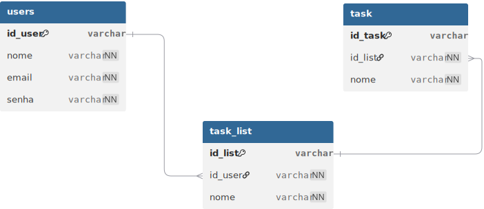

# 📋 Projeto de Gerenciamento de Tarefas

## 👩‍💻 Integrantes

-   Maya\
-   Bia\
-   Pierre\
-   Nando

## 🛠️ Tecnologias Utilizadas

-   HTML\
-   CSS\
-   Bootstrap

```
📂 projeto-tarefas
 ├── 📂 assets
 │    ├── logos/
 │    ├── images/
 │    ├── videos/
 │    ├── mer.png
 │    └── der.png
 ├── index.html        # Tela de login
 ├── cadastro.html     # Tela de cadastro
 ├── home.html         # Tela inicial
 ├── listas.html       # Listas de tarefas
 ├── tarefas.html      # Tela de tarefas
 ├── style.css
 └── README.md
```

## 🖼️ Telas Desenvolvidas

1.  **Login (index.html)**
2.  **Cadastro (cadastro.html)**
3.  **Home (home.html)**
4.  **Listas de Tarefas (listas.html)**
5.  **Tarefas (tarefas.html)**

## Modelo Entidade-Relacionamento (MER)


## Diagrama Entidade-Relacionamento (DER)
